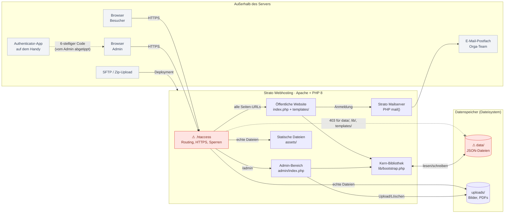
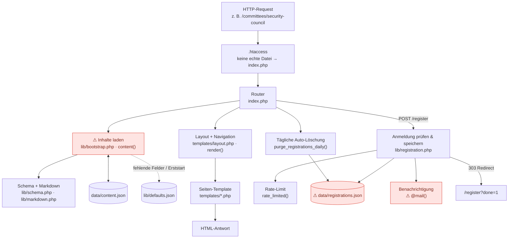
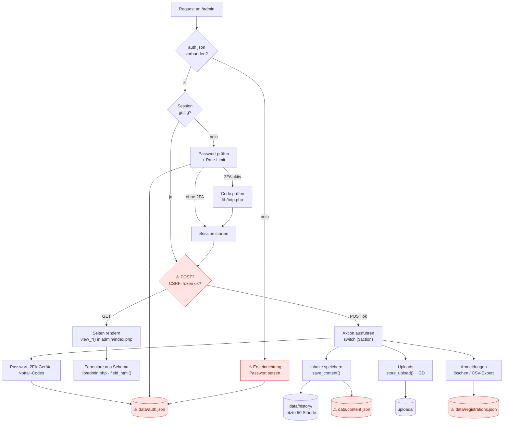
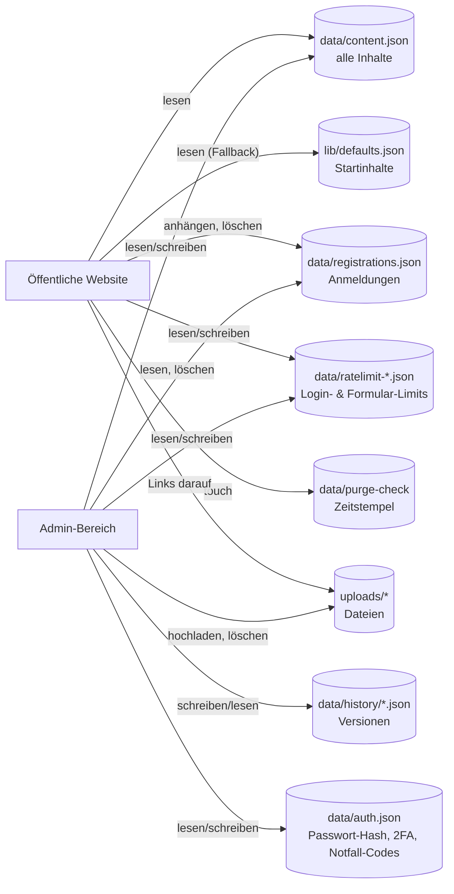

# Architektur – OMUN-Website

Überblick für Troubleshooting. Stand: Commit `ea3fa33` (September 2026).
Bei größeren Änderungen am Code bitte die Diagramme mit anpassen.

Das System besteht aus drei klar getrennten Teilen, die sich einen gemeinsamen Datenspeicher teilen:

1. **Öffentliche Website:** `index.php`, `templates/`, `assets/`
2. **Admin-Bereich:** `admin/`, `lib/admin.php`, `lib/totp.php`
3. **Datenspeicher:** JSON-Dateien in `data/` und hochgeladene Dateien in `uploads/`

Es gibt **keine Datenbank, kein Framework und keine externen Bibliotheken zur Laufzeit** (einzige Ausnahme: `admin/qrcode.js`, lokal eingebunden).

---

## 1. Gesamtbild: Wer spricht mit wem?

| Knoten | Was es tut | Wo im Code |
| --- | --- | --- |
| **.htaccess** | Leitet auf HTTPS um, schickt alle URLs ohne echte Datei an `index.php` und sperrt interne Ordner. | `.htaccess`, `data/.htaccess`, `lib/.htaccess`, `templates/.htaccess`, `uploads/.htaccess` |
| **Öffentliche Website** | Router, der für jede URL das passende Template mit Inhalten rendert. | `index.php`, `templates/*.php` |
| **Admin-Bereich** | Login, 2FA und alle Bearbeitungsfunktionen: Controller und Views in einer Datei. | `admin/index.php` (+ `admin.css`, `admin.js`, `qrcode.js`) |
| **Kern-Bibliothek** | Pfade, JSON lesen und schreiben, Inhalte laden, Sessions, CSRF, Rate-Limit, Hilfsfunktionen. | `lib/bootstrap.php` |
| **Statische Dateien** | CSS, JavaScript (Countdown, Menü), lokal gehostete Schriften, Favicon. | `assets/` |
| **data/** | Alle Live-Daten: Inhalte, Passwort und 2FA, Anmeldungen, Versionen, Rate-Limits. | `data/` (siehe Abschnitt 4) |
| **uploads/** | Hochgeladene Bilder und Dokumente, öffentlich abrufbar, ohne Skriptausführung. | `uploads/` |
| **Strato Mailserver** | Verschickt die Benachrichtigung bei neuen Anmeldungen. | Aufruf in `lib/registration.php` → `notify_registration()` |
| **Authenticator-App** | Erzeugt die 2FA-Codes. Es gibt keine Netzverbindung zum Server, nur die gleiche Uhrzeit und ein geteilter Schlüssel. | Prüfung in `lib/totp.php` |

---

## 2. Öffentliche Website: Weg eines Seitenaufrufs

| Knoten | Was es tut | Wo im Code |
| --- | --- | --- |
| **Router** | Zerlegt die URL und wählt Template und Titel aus. Unbekannte URLs werden als Zusatzseite gesucht, sonst gibt es 404. | `index.php` (`switch ($route)`) |
| **Tägliche Auto-Löschung** | Löscht höchstens einmal pro Tag alte Anmeldungen. Gesteuert über die Datei `data/purge-check`. | `lib/registration.php` → `purge_registrations_daily()` |
| **Inhalte laden** | Liest `content.json` einmal pro Request, füllt fehlende Schlüssel aus `defaults.json` und legt die Datei beim ersten Start an. | `lib/bootstrap.php` → `content()`, `c()` |
| **Schema + Markdown** | Das Schema beschreibt alle Felder, der Markdown-Renderer wandelt Admin-Texte sicher in HTML um. | `lib/schema.php`, `lib/markdown.php` → `md()` |
| **Layout + Navigation** | Rahmen jeder Seite: Head, Farben aus dem Admin, Menü (blendet leere Bereiche aus), Footer. | `templates/layout.php` → `render()`, `main_nav()` |
| **Seiten-Template** | Eine Datei pro Seitentyp, gemeinsame Bausteine stehen in `_pagehead.php` und `_files.php`. | `templates/` |
| **Anmeldung** | Validierung, Honeypot, Mindestzeit, Rate-Limit, Speichern, Mail und danach ein Redirect. | `lib/registration.php` → `handle_registration()` |

---

## 3. Admin-Bereich: Login und Bearbeiten

| Knoten | Was es tut | Wo im Code |
| --- | --- | --- |
| **Ersteinrichtung** | Solange `data/auth.json` fehlt, darf jeder Besucher von /admin ein Passwort setzen. | `admin/index.php` (Block `if (!is_setup())`) |
| **Passwort prüfen** | Prüft den bcrypt-Hash, erlaubt 8 Versuche in 15 Minuten pro IP und leitet danach zur 2FA oder direkt in die Session. | `admin/index.php` (Block `if (!is_logged_in())`), `lib/admin.php` → `check_password()` |
| **Code prüfen (2FA)** | Prüft TOTP-Codes (±30 s) aller Geräte, verhindert die Wiederverwendung eines Codes und akzeptiert alternativ Notfall-Codes. | `lib/totp.php`, `lib/admin.php` → `verify_second_factor()` |
| **Session** | Cookie `omun_sid`, 3 h Inaktivitäts-Timeout. Ein Passwortwechsel macht alle Sessions ungültig (über `v` in auth.json). | `lib/bootstrap.php` → `start_session()`, `lib/admin.php` → `is_logged_in()`, `login_session()` |
| **CSRF-Prüfung** | Jeder POST braucht ein gültiges Token aus der Session. | `lib/bootstrap.php` → `csrf_check()` |
| **Seiten rendern** | Übersicht, Bereichs-Formulare, Listen, Anmeldungen, Mediathek, Versionen, Sicherheit. | `admin/index.php` → `view_*()` |
| **Formulare aus Schema** | Erzeugt Eingabefelder aus `schema()` und liest sie beim Speichern wieder aus (inkl. Uploads und Wiederholzeilen). | `lib/admin.php` → `field_html()`, `field_value()`, `repeater_row()` |
| **Inhalte speichern** | Sichert den alten Stand in `data/history/` und schreibt dann `content.json` atomar. | `lib/admin.php` → `save_content()`, `snapshot_content()` |
| **Uploads** | Prüft Endung und MIME-Typ, vergibt eindeutige Namen, verkleinert und dreht Fotos (falls GD verfügbar). | `lib/admin.php` → `store_upload()`, `optimize_image()` |
| **Anmeldungen** | Liste, Suche, CSV-Export (mit BOM und Schutz vor Formeln), einzelne oder alle löschen. | `admin/index.php` → `view_registrations()` und `case 'reg_*'` |
| **Sicherheit** | Passwortwechsel, 2FA-Geräte hinzufügen und entfernen, Notfall-Codes, Backup-Export und -Import. | `admin/index.php` → `view_settings()`, `view_2fa()` |

---

## 4. Datenspeicher: Welche Datei wird von wem benutzt?

| Datei | Inhalt | Geschrieben von | Wenn sie fehlt oder kaputt ist … |
| --- | --- | --- | --- |
| `data/content.json` | Alle Texte, Listen, Einstellungen | `write_json()` (atomar), Admin | … wird sie aus `defaults.json` neu erzeugt. Ist sie **kaputt**, zeigt die Seite ohne Warnung die Standardinhalte (siehe R2). |
| `lib/defaults.json` | Startinhalte, Liegt im Code, nicht in `data/` | nur Entwickler | … fehlen Standardwerte, und neue Felder bleiben leer. |
| `data/history/*.json` | Stand **vor** jeder Änderung, maximal 50 | `snapshot_content()` | … ist nur kein Zurücksetzen möglich, sonst keine Folgen. |
| `data/registrations.json` | Anmeldungen | `append_json()` (mit Lock), Löschen per `write_json()` | … gilt die Liste als leer. |
| `data/auth.json` | Passwort-Hash, Session-Version `v`, 2FA-Geräte, Notfall-Codes | Admin | … ist die **Ersteinrichtung wieder offen** (siehe R3). |
| `data/ratelimit-*.json` | Zeitstempel der Versuche pro IP-Hash | `rate_limited()` | … ist das harmlos und wird neu angelegt. |
| `data/purge-check` | Nur das Änderungsdatum zählt | `purge_registrations_daily()` | … läuft die Löschprüfung beim nächsten Aufruf erneut. |

---

## 5. Bekannte Fehlerquellen & Troubleshooting

Die folgenden Punkte sind beim Lesen des Codes aufgefallen. Ⓡ = echtes Risiko im Code, Ⓑ = Betriebs- bzw. Konfigurationsfalle.

### Risiken im Code

| # | Stelle | Problem | Symptom |
| --- | --- | --- | --- |
| **R1** Ⓡ | `lib/registration.php` → `purge_registrations()`, `admin/index.php` → `case 'reg_delete'` | `append_json()` sperrt die Datei mit `flock`, Löschen und Auto-Löschung ersetzen sie aber ohne Lock per `rename`. Kommt genau dabei eine Anmeldung herein, geht sie verloren. | Eine Anmeldung fehlt, obwohl die Person die Erfolgsseite gesehen hat. Selten, am ehesten während einer Löschaktion. |
| **R2** Ⓡ | `lib/bootstrap.php` → `content()` / `read_json()` | Ist `content.json` beschädigt (z. B. halb hochgeladen per SFTP), liefert `read_json()` still `[]`, und die Seite zeigt komplett die Standardinhalte. Speichert danach jemand im Admin, werden diese Standardinhalte zum neuen Stand. | Die Website zeigt plötzlich wieder die Platzhalter-Texte. **Nichts im Admin speichern**, sondern unter *Versionen* den letzten guten Stand wiederherstellen. |
| **R3** Ⓡ | `admin/index.php` → Ersteinrichtung | Fehlt `data/auth.json` (gelöscht, nicht hochgeladen, Rechte-Problem), kann **jeder** Besucher unter /admin ein neues Passwort setzen. | Unbekanntes Passwort, der eigene Login funktioniert nicht mehr. |
| **R4** Ⓡ | `lib/bootstrap.php` → `rate_limited()` | Lesen, Ändern, Schreiben ohne Lock: Bei vielen **gleichzeitigen** Login-Versuchen gehen Zählungen verloren. Das Limit von 8 Versuchen lässt sich so teilweise umgehen. | Nicht sichtbar. Relevant nur bei gezielten Angriffen, 2FA fängt das ab. |
| **R5** Ⓡ | `lib/admin.php` → `save_content()` | Speichern zwei Personen gleichzeitig, gewinnt die letzte, ohne Warnung. Der überschriebene Stand liegt aber in *Versionen*. | Änderungen einer Person sind „weg“. |
| **R6** Ⓡ | `lib/registration.php` → `notify_registration()` | `@mail()` unterdrückt alle Fehler. Ob die Mail rausging, wird nirgends protokolliert. | Anmeldungen kommen im Admin an, aber es gibt keine E-Mail. Absender `noreply@<domain>` prüfen und im Strato-Mailmenü nachsehen. |
| **R7** Ⓡ | `index.php` / `lib/bootstrap.php` → `write_json()` | Ist `data/` nicht beschreibbar, wirft schon der erste Seitenaufruf eine Exception, ohne eigene Fehlerseite. | Weiße Seite oder Fehler 500 direkt nach dem Hochladen. Rechte von `data/` auf 755 setzen. |

### Betriebsfallen

| # | Stelle | Problem | Symptom / Lösung |
| --- | --- | --- | --- |
| **B1** Ⓑ | `.htaccess` | Die gesamte Sicherheit von `data/` hängt davon ab, dass Apache die `.htaccess` beachtet. Ohne `mod_rewrite` funktionieren außerdem keine Unterseiten. | Unterseiten liefern 404, oder `/data/auth.json` ist lesbar. **Nach jedem Deployment testen:** `/data/auth.json` muss 403 liefern. |
| **B2** Ⓑ | PHP-Einstellung `post_max_size` | Ist ein Upload größer als `post_max_size`, verwirft PHP den ganzen POST, also auch das CSRF-Token. | Die irreführende Meldung **„Sitzung abgelaufen“** beim Hochladen großer Dateien. Datei verkleinern oder das Limit im Strato-Menü erhöhen. |
| **B3** Ⓑ | PHP-Einstellung `session.gc_maxlifetime` | Der Code erlaubt 3 h Inaktivität, PHP löscht Sessions aber evtl. schon nach dem Server-Standard (oft 24 min). | Man wird nach ca. 20–30 Minuten abgemeldet. |
| **B4** Ⓑ | `lib/totp.php` | Die Codes hängen von der Uhrzeit ab (±30 s Toleranz), und derselbe Code gilt nur einmal. | „Code falsch“: Uhrzeit am Handy auf automatisch stellen oder auf den nächsten Code warten. |
| **B5** Ⓑ | Deployment | Wer beim Update `data/` oder `uploads/` überschreibt, verliert Inhalte, Passwort und Anmeldungen. | Alles ist wieder auf Standard, das Passwort ist das aus der Zip. |
| **B6** Ⓑ | `lib/bootstrap.php` → `BASE`, `.htaccess` → `RewriteBase /` | Der Code unterstützt Unterordner, die `.htaccess` ist aber fest auf das Hauptverzeichnis eingestellt. | In einem Unterordner (z. B. `/test/`) funktionieren die Unterseiten nicht. `RewriteBase` anpassen. |
| **B7** Ⓑ | `lib/admin.php` → `optimize_image()`, `store_upload()` | Die Bildverkleinerung braucht die PHP-Erweiterung GD, die MIME-Prüfung braucht fileinfo. Fehlen sie, wird der Schritt **still übersprungen**. | Riesige Handy-Fotos, langsame Seite. |
| **B8** Ⓑ | Kopplung `lib/schema.php` ↔ `lib/defaults.json` ↔ `templates/` | Ein neues Feld muss an drei Stellen eingetragen werden. `content()` ergänzt fehlende Werte nur eine Ebene tief, also nicht in Listeneinträgen. | Ein neues Feld erscheint im Admin, aber nicht auf der Seite (Template vergessen) oder umgekehrt. |

### Schnell-Checkliste bei Problemen

1. **Weiße Seite / 500:** Sind `data/` und `uploads/` beschreibbar? Ist PHP ≥ 8.1 eingestellt? (R7)
2. **Unterseiten 404, Startseite geht:** Wird `.htaccess` beachtet, ist `mod_rewrite` aktiv? (B1, B6)
3. **Platzhalter-Texte statt echter Inhalte:** `data/content.json` beschädigt oder überschrieben. Unter *Versionen* wiederherstellen, **vorher nicht speichern**. (R2, B5)
4. **„Sitzung abgelaufen“ beim Speichern:** Datei zu groß (B2) oder Session abgelaufen (B3). Seite neu laden und nochmal versuchen.
5. **Login geht nicht:** 15 Minuten warten (Rate-Limit), Uhrzeit am Handy prüfen (B4), notfalls `data/auth.json` per SFTP löschen **und sofort** neu einrichten (R3).
6. **Keine E-Mails bei Anmeldungen:** Adresse unter *Anmeldung* eingetragen? Mailversand im Strato-Paket aktiv? (R6)
